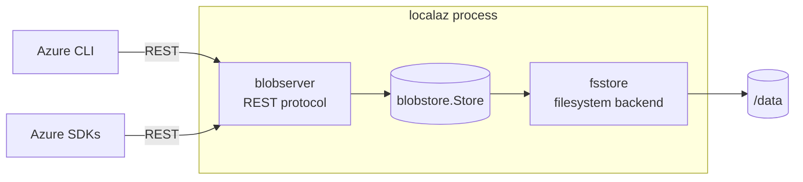

# Architecture

localaz is a single Go process that speaks the native Azure service protocols.
The Azure CLI and the official SDKs talk to it exactly as they would talk to
Azure — no shims, no client changes. Each emulated service listens on its own
port (mirroring Azurite), but they all run inside the one process and ship in
the one container.

## Layout

```
cmd/localaz            entrypoint / process wiring (one listener per service)
internal/blobserver    Azure Blob REST protocol (routing, XML, headers, errors)
internal/blobstore     storage abstraction (the Store interface)
  └── fsstore          filesystem-backed implementation (in-memory index + disk)
internal/egserver      Event Grid REST protocol (namespace topics, pull delivery)
internal/egstore       in-memory Event Grid pub/sub state
internal/wpsserver     Web PubSub (REST + WebSocket json.webpubsub.azure.v1)
internal/sbserver      Service Bus AMQP 1.0 protocol (hand-rolled framing/codec)
internal/sbstore       in-memory Service Bus broker (queues + topic fan-out)
internal/azerr         faithful Azure error responses
test/sdk               integration tests via the Azure Go SDKs
test/e2e               end-to-end tests via the Azure CLI
docker/                Dockerfile and dev compose stack
docs/                  configuration, supported APIs, testing
```

## Services and ports

| Service     | Port    | Protocol          | Packages                       |
| ----------- | ------- | ----------------- | ------------------------------ |
| Blob        | `10000` | HTTP/REST         | `blobserver` + `blobstore`     |
| Event Grid  | `10001` | HTTP/REST         | `egserver` + `egstore`         |
| Web PubSub  | `10002` | HTTP + WebSocket  | `wpsserver`                    |
| Service Bus | `5672`  | AMQP 1.0 over TCP | `sbserver` + `sbstore`         |

`cmd/localaz` starts each HTTP service on its own `http.Server` goroutine and
starts Service Bus on a raw `net.Listen` accept loop (AMQP is not HTTP), then
shuts them all down together on signal.

## Layering



The HTTP layer (`internal/blobserver`) depends **only** on the
`blobstore.Store` interface. It knows nothing about how bytes are stored. This
boundary is the key design decision:

- The protocol code can be tested and reasoned about independently.
- A different backend (PostgreSQL for metadata, object storage or Redis for
  payloads) can be dropped in by implementing `Store`, without touching a single
  line of protocol code.
- Whatever a backend needs would be **embedded inside the same container**, so
  the user-facing promise — run one container — never changes.

## The storage backend

`fsstore` keeps an in-memory index of accounts → containers → blobs for fast
listing and lookups, and writes every mutation through to disk. On startup it
rebuilds the index from disk, so a mounted `/data` volume preserves state across
restarts. Blob payloads live on disk and are read on demand.

On-disk layout:

```
<root>/<account>/<container>/_container.json    container metadata
<root>/<account>/<container>/data/<key>         blob payload
<root>/<account>/<container>/meta/<key>.json    blob metadata
<root>/<account>/<container>/blocks/<key>/<id>  staged, uncommitted block
```

where `<key>` is the URL-safe base64 encoding of the blob name (blob names may
contain `/`, which is not filesystem-safe).

## Authentication

The emulator accepts the Shared Key `Authorization` header that the SDKs and CLI
send but does not verify the signature. This is standard behaviour for a local
development emulator (Azurite behaves the same way by default) and lets any
client work with the well-known development credentials. Signature verification
is on the roadmap as an opt-in mode.

## Adding a service

A new service (Queue, Table, …) follows the same pattern:

1. Define a storage interface for the service under `internal/<svc>store`.
2. Implement the protocol in `internal/<svc>server`, depending only on that
   interface.
3. Mount it in `cmd/localaz` on the same process (its own port, matching Azure's
   endpoint conventions): HTTP services join the `services` slice; a raw-TCP
   service (like Service Bus AMQP) gets its own accept loop.
4. Add a Go SDK suite under `test/sdk` and CLI coverage under `test/e2e`.

## The pub/sub services

Event Grid, Web PubSub, and Service Bus keep their state in memory — pub/sub
traffic is transient, so there is no disk format to preserve. Service Bus is the
one service that does not speak HTTP: `internal/sbserver` implements just enough
of AMQP 1.0 (protocol headers, SASL ANONYMOUS, the open/begin/attach handshake,
flow-controlled transfers, dispositions, and CBS auth) for the official
`azservicebus` SDK to work unchanged when it connects with
`UseDevelopmentEmulator=true`. Message bodies are relayed verbatim, so only the
performative and CBS surface is decoded.
