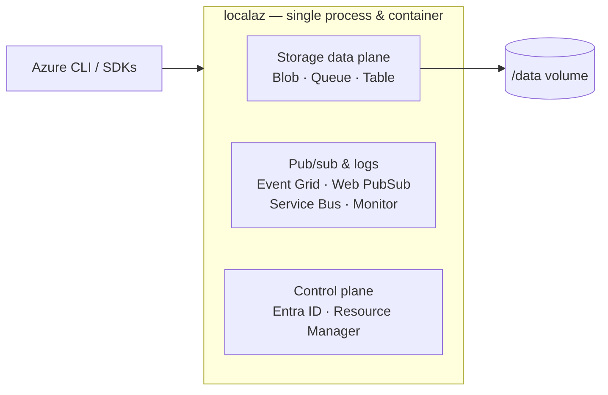

# localaz

**localaz** is a local **Azure emulator**, in the spirit of LocalStack (AWS) and
localgcp (GCP). You run a single Docker container and point the **Azure CLI** or
any **Azure SDK** at it — no code changes required.

It speaks the native Azure service protocols, so the CLI and the official SDKs
build, sign, and parse requests exactly as they would against Azure. Everything
runs on its own port inside the one process and container.

## Supported services

localaz provide partial support for the following services:

 - [Blob Storage](/services/blob)
 - [Queue Storage](/services/queue)
 - [Table Storage](/services/table)
 - [Event Grid](/services/event-grid)
 - [Web PubSub](/services/web-pubsub)
 - [Service Bus](/services/service-bus)
 - [Monitor Logs](/services/monitor-logs)
 - [Entra ID](/services/control-plane)
 - [Resource Manager](/services/control-plane)
 - [Key Vault](/services/key-vault)

## Architecture

localaz is a **single Go process**. Each emulated service listens on its own
port, but they all share the one binary and ship in the one container.

- The **storage** services (Blob, Queue, Table) persist their state under
  `/data`; mount a volume to keep it across restarts.
- The **pub/sub and logs** services (Event Grid, Web PubSub, Service Bus,
  Monitor Logs) keep transient state in memory.
- The **control plane** (Entra ID + Resource Manager) lets the CLI/SDKs register
  localaz as a custom Azure cloud, sign in, and route data-plane commands to it.
  It is in-memory and requires TLS, because MSAL and azure-core refuse to send
  bearer tokens over plain HTTP.

## Next steps

- [Get Started](get-started/) — build and run the Docker image.
- [Services](services/) — per-service URLs, configuration, and SDK/CLI examples.
