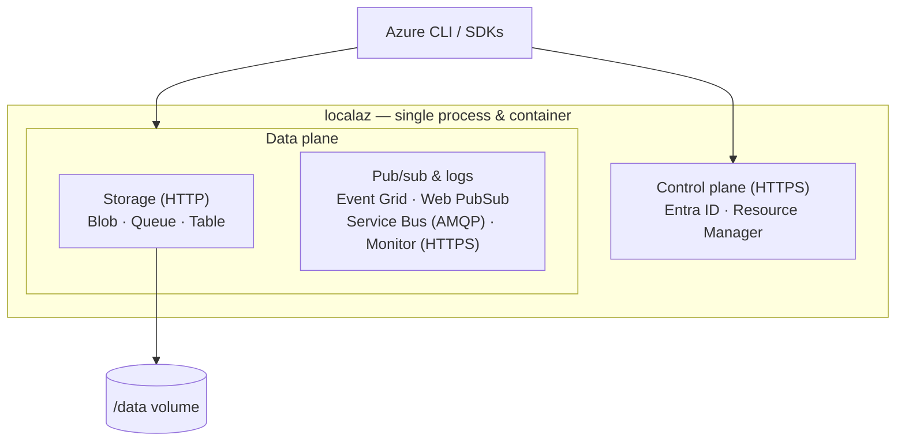
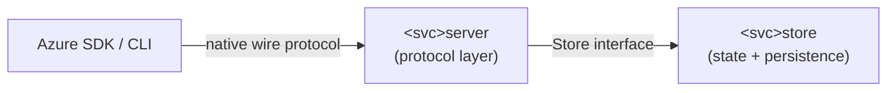

localaz is a **single Go process**, shipped as **one Docker container**. Every
emulated Azure service listens on its own port, but they all share the one binary
and the one container — so you only ever run a single thing.

## One process, one listener per service

`cmd/localaz` wires up every service and mounts each on its own listener. The
HTTP services share a common `http.Server` setup; Service Bus speaks raw AMQP 1.0
and gets its own `net.Listen` accept loop. A small access-log middleware wraps
every handler — it logs method, path, status, and duration, and recovers panics
so a single handler crash returns a `500` instead of dropping the request.

**Graceful shutdown is shared.** On `SIGINT`/`SIGTERM`, or if any single listener
fails to bind or serve, the process gracefully shuts down *all* listeners (each
`http.Server` with a 10s timeout, then the AMQP listener) rather than calling
`os.Exit` from inside a goroutine. One late bind failure therefore drains every
other listener cleanly.

## The server/store split

Each service is two layers, and the dependency only ever points one way:

- **`internal/servers/<svc>server`** — the protocol layer. It speaks the exact
  Azure wire format (XML element names, header casing, date formats, OData JSON,
  AMQP framing) so the official SDKs and the CLI build, sign, and parse requests
  exactly as they would against Azure. It depends **only** on the store's `Store`
  interface — never on a concrete backend.
- **`internal/stores/<svc>store`** — the state layer. It holds the data and,
  for the storage services, persists it.

This split keeps the wire-fidelity concerns separate from storage concerns, and
makes each backend swappable behind its interface.

## Persistence model

| Tier | Services | State |
| ---- | -------- | ----- |
| Persisted | Blob, Queue, Table | On disk under `-data` (default `/data`) |
| Transient | Event Grid, Web PubSub, Service Bus, Monitor Logs | In memory |
| Transient | Entra ID, Resource Manager | In memory |

The storage tier is **crash-safe**: every on-disk write (the queue/table JSON
snapshots, blob data, and metadata files) goes through a temp file → fsync →
rename → parent-dir fsync sequence, so a crash leaves either the old file or the
fully written new one. Blob bodies are **streamed** to and from disk via
`io.Reader`/`io.ReadCloser` (never buffered whole in memory), so large or
concurrent blobs cannot exhaust memory.

The pub/sub and control-plane tiers are intentionally in-memory: their traffic is
transient, so there is no on-disk format for them. (The one exception is the
Entra ID RS256 signing key, persisted under `<data>/aad/` so issued tokens stay
valid across restarts.)

## Control plane and TLS

The **Entra ID (AAD)** and **Resource Manager (ARM)** services let the CLI and
SDKs treat localaz as a custom Azure cloud: register it once, sign in with a
service principal, and route data-plane commands (such as `az servicebus` or
`az monitor log-analytics query`) to localaz.

These services — and Monitor Logs — carry **bearer tokens**, and MSAL/azure-core
refuse to send bearer tokens over plain HTTP. So the control plane **requires
TLS**: run with `-tls-auto` (or supply `-tls-cert`/`-tls-key`) and have clients
trust the certificate. Tokens are hand-rolled RS256 JWTs that verify against a
published JWKS. See [Reference](../reference/) for the TLS flags and
[Control plane](../services/control-plane/) for the sign-in recipe.

## Security posture

localaz is a **local development emulator**, not a production service, and its
defaults reflect that:

- **Authentication is accepted but not verified.** The Shared Key
  `Authorization` header, Service Bus CBS tokens, and bearer tokens are parsed
  but never validated — which is exactly what makes the shared development
  account and "any credential works" experience possible.
- **Inputs are bounded as defense-in-depth.** Even without auth, the emulator
  guards against resource exhaustion: AMQP frame sizes and list/map element
  counts are capped, Monitor ingestion bounds both the raw upload and the
  gunzipped stream, ARM provider bodies and the resource store are size-limited,
  and the `$filter`/KQL parsers cap nesting depth.

## Adding a service

The single-container promise — everything a backend needs is embedded in the same
image — always holds. Adding a service means: define a `Store` interface in
`internal/stores/<svc>store`, implement the protocol in
`internal/servers/<svc>server` against that interface, mount it in `cmd/localaz`,
and add SDK + CLI tests. See
[CONTRIBUTING.md](https://github.com/link-society/localaz/blob/main/CONTRIBUTING.md)
and `AGENTS.md` for the full checklist.
