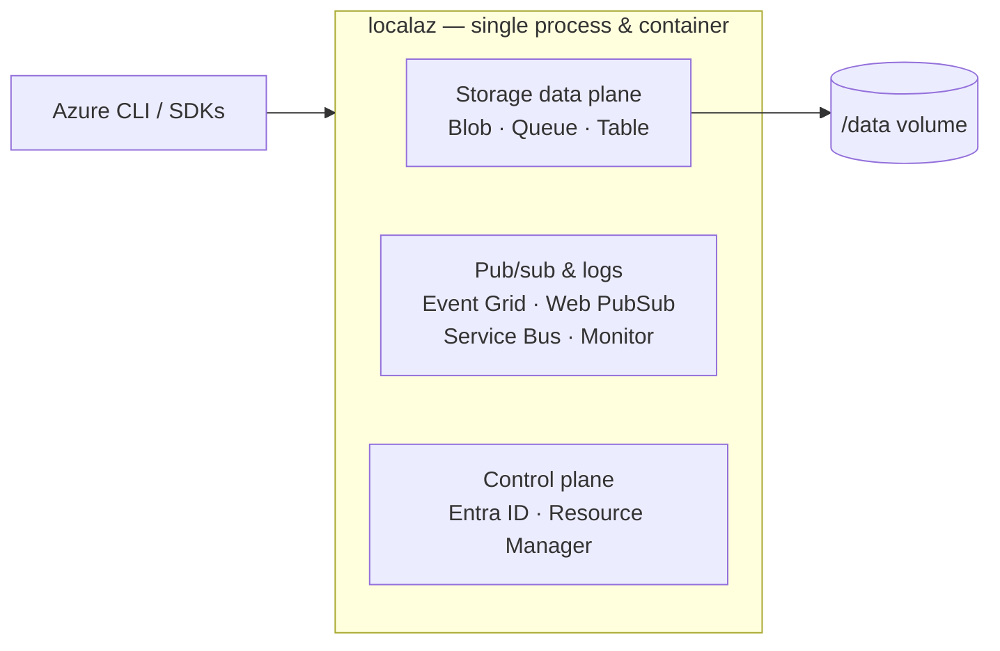

localaz is a single Go binary, shipped as one Docker container, that speaks the
native Azure service protocols so the Azure CLI and the official SDKs work
against it unchanged. This page explains how that binary is put together.

## Single process, single container

There is one Go process. Each emulated service runs on its own port behind its
own listener, all inside that single process:

- Blob, Queue and Table are HTTP/REST listeners.
- Event Grid and Web PubSub are HTTP/REST listeners.
- Monitor Logs, plus the Entra ID and Resource Manager control plane, are HTTPS
  listeners — they carry bearer tokens, which clients refuse to send over plain
  HTTP.
- Service Bus is not HTTP: it runs its own AMQP 1.0 accept loop over plain TCP.

The HTTP services join a shared `services` slice; the non-HTTP Service Bus
listener is wired into the very same lifecycle. All of them, HTTP and AMQP
alike, share one graceful-shutdown path: a listener failure triggers a clean
shutdown of every other listener rather than an abrupt process exit, so nothing
is left half-running.

## Store vs server separation

Every service is split into two layers:

- A **protocol layer** in `internal/servers/<svc>server`. This handles the
  Azure wire format — routing, XML/JSON encoding, header casing, error shapes —
  and depends only on a store interface, never on a concrete backend.
- A **store interface** in `internal/stores/<svc>store`. This defines the
  `Store` type and shared data types the protocol layer is allowed to touch.

Concrete backends live behind that interface. For storage, the filesystem
implementation `fsstore` sits behind `blobstore.Store`; the protocol layer
never reaches into it directly. This keeps the protocol code honest and makes a
backend swappable without touching the wire format.

## Persistence model

Only the storage data plane is durable. Blob, Queue and Table persist their
state under `/data`; mount a volume there to keep it across container restarts.

- **Blob** data is filesystem-backed: blob bytes are streamed to files, and only
  blob metadata is kept in memory and rebuilt from disk on startup.
- **Queue** and **Table** each keep their state in memory and persist it as a
  single JSON snapshot (`queue/queues.json`, `table/tables.json`).

Every on-disk write is crash-safe via `internal/utils/atomicfile`: write to a
temp file, fsync it, rename it into place, then fsync the parent directory. A
crash therefore leaves either the old file or the fully written new one — never
a truncated file.

The pub/sub services (Event Grid, Web PubSub, Service Bus), Monitor Logs, and
the control plane are **in-memory and transient**. Their traffic is ephemeral,
so there is no `/data` format for them and their state does not survive a
restart.

## Control plane & TLS

Entra ID and Resource Manager form a small control plane that lets clients
register localaz as a custom Azure cloud: discover endpoints, log in, and route
data-plane commands to the right local service.

These endpoints — and Monitor Logs — must serve **HTTPS**. MSAL and azure-core
refuse to send bearer tokens over plain HTTP, so plain-HTTP authorities are
rejected outright. Enable TLS with `-tls-auto` (which writes a self-signed cert
and key under `<data>/tls`) or supply your own with `-tls-cert`/`-tls-key`. The
storage and Event Grid / Web PubSub endpoints, by contrast, are served over
plain HTTP.

---

For contributor-level conventions and a detailed catalogue of gotchas, see
AGENTS.md in the repository.
