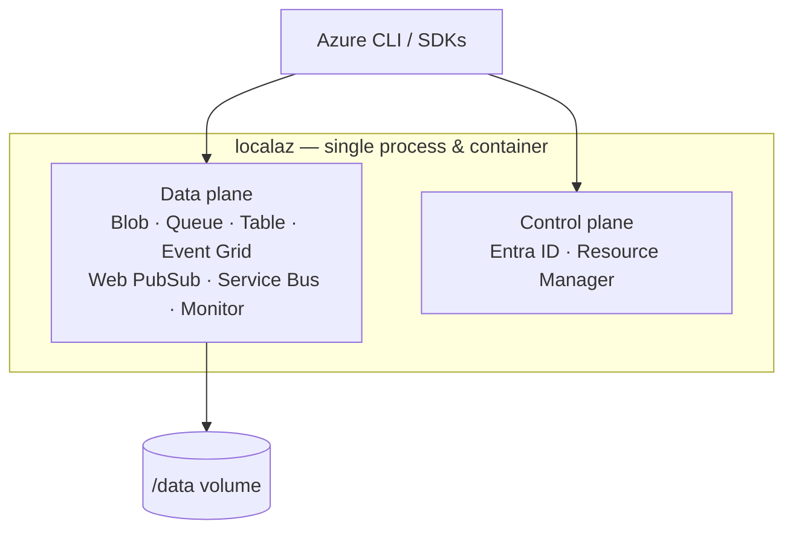

localaz is a **single Go process**, shipped as **one Docker container**. Every
emulated Azure service listens on its own port, but they all share the one binary
and the one container — so you only ever run a single thing.

## Data plane vs control plane

The **data plane** is where your application does its work: storing blobs,
sending messages, publishing events, querying logs. These services accept the
same requests your code would send to Azure.

The **control plane** lets the CLI and SDKs treat localaz as a custom Azure
cloud — registering the environment, signing in, and routing data-plane commands
to localaz instead of the real cloud.

## Persistence model

| Service | Persisted |
| ------- | --------- |
| Blob | &#9989; |
| Queue | &#9989; |
| Table | &#9989; |
| Event Grid | &#10060; |
| Web PubSub | &#10060; |
| Service Bus | &#10060; |
| Monitor | &#10060; |
| Entra ID | &#10060; |
| Resource Manager | &#10060; |

Persisted state lives in the data directory set by the `-data` CLI flag. See
[Reference](../reference/) for that flag.

## TLS

The control plane (Entra ID, Resource Manager) and Monitor Logs carry **bearer
tokens**, and Azure client libraries refuse to send bearer tokens over plain
HTTP — so those services **require HTTPS**. The storage and pub/sub services stay
on plain HTTP. See [Reference](../reference/) for the TLS flags and
[Control plane](../services/control-plane/) for the sign-in recipe.

## Security posture

localaz is a **local development emulator**, not a production service.
Authentication is accepted but **not verified** — any credential works. That is
a deliberate stance: it is exactly what makes the shared development account and
the "any credential works" experience possible.
